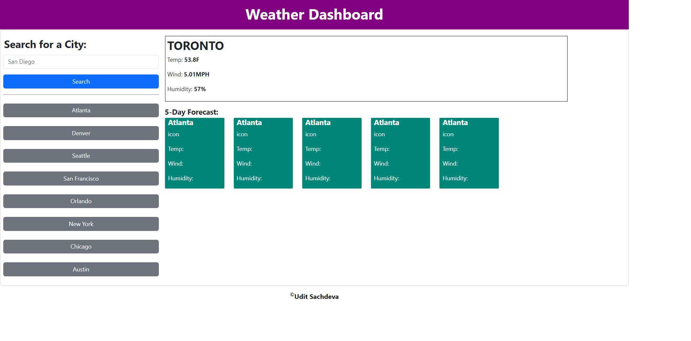

# Weather-App

```
BootCamp 2024 challenge. Creating the Weather App.
```

## User Story

```
FOR travellers who love to travel in multiple cities,
THEY need a weather app for multiple cities,
SO they can plan accordingly.
```

## Acceptance

```
WHEN the user give the input to the weather dashboard,
THEN the weather of that city will be shown.
WHEN the user click on the button of the city,
THEN the weather of the city will be shown,
AND the cards for the city weather will be shown for different days.

```

## links

```
Repo:
https://github.com/usachdeva/Weather-App

Deployed:
https://usachdeva.github.io/Weather-App/

```

## Screenshot


